# 🛡️ Архитектура Корпоративного DLP-шлюза с RAG

Этот документ описывает устройство прототипа безопасного AI-шлюза, который мы разработали. Он позволяет сотрудникам компании использовать облачные нейросети (например, DeepSeek), не опасаясь утечки конфиденциальных данных, и при этом нейросеть имеет доступ к внутренней корпоративной базе знаний.

---

## 🏗️ Общая схема работы (Пайплайн)

```mermaid
sequenceDiagram
    participant User as 👤 Пользователь (Open-WebUI)
    participant Gateway as 🛡️ DLP-Шлюз (FastAPI)
    participant RAG as 📚 База Знаний (Qdrant)
    participant NLP as 🧠 NLP-Движок (Natasha + Presidio)
    participant LLM as ☁️ Облачная Нейросеть (DeepSeek)

    User->>Gateway: Отправляет запрос (с ФИО, картами, телефонами)
    
    rect rgb(20, 20, 20)
    Note over Gateway, RAG: 1. Поиск по корпоративной базе (RAG)
    Gateway->>RAG: Ищет похожие документы (BM25 + Векторы)
    RAG-->>Gateway: Возвращает релевантные куски текста
    end
    
    rect rgb(20, 20, 20)
    Note over Gateway, NLP: 2. Анонимизация данных (DLP)
    Gateway->>NLP: Анализ текста на секретные данные
    NLP-->>Gateway: Возвращает текст с реалистичными фейками
    end
    
    Gateway->>LLM: Отправляет фейковый текст + контекст из базы
    LLM-->>Gateway: Нейросеть отвечает, используя фейковые данные
    
    rect rgb(20, 20, 20)
    Note over Gateway, NLP: 3. Деанонимизация (Восстановление)
    Gateway->>Gateway: Заменяет фейки обратно на реальные данные
    end
    
    Gateway-->>User: Возвращает готовый ответ с реальными данными
```

---

## 🛠️ Какие технологии применяются и где

### 1. Пользовательский интерфейс: **Open-WebUI**
Визуальная оболочка, где пользователи печатают запросы. Она ничем не отличается от обычного ChatGPT. Пользователь не знает, что под капотом его данные перехватываются.

### 2. Ядро маршрутизатора: **FastAPI** (Python)
Сердце нашей системы (`main.py`). Шлюз притворяется сервером OpenAI (принимает запросы в формате OpenAI API) и выступает "посредником" между пользователем и облаком. Он отвечает за:
- Перехват запросов
- Применение ролевых промптов (через `user_profiles.py`, например, настройка для Юридического отдела)
- Логирование всех действий в `audit.log`.

### 3. База Знаний (RAG): **Qdrant + FastEmbed**
Позволяет нейросети "читать" локальные корпоративные документы (например, лекции по военной топографии), которых нет в интернете.
- **Гибридный поиск:** Использует как плотные векторы (смысловой поиск), так и разреженные векторы (BM25, поиск по точным ключевым словам). 
- Позволяет нейросети давать точные ответы по Уставу или правилам привязки без галлюцинаций.

### 4. Защита данных (DLP): **Microsoft Presidio + Natasha + Faker**
Это самый сложный и инновационный модуль системы (`anonymizer.py`).
- **Microsoft Presidio:** Общий фреймворк для поиска конфиденциальных данных (PII).
- **Natasha (NLP):** Специализированная библиотека для русского языка. Она работает на базе графов и нейросетей, идеально находит полные ФИО ("Сидоров Петр Алексеевич") и не разрывает их на части (в отличие от западных аналогов вроде spaCy).
- **Кастомные регулярные выражения (RegEx):** Быстро и жестко вырезают номера карт, ИНН, СНИЛС и российские номера телефонов.
- **Faker & PyMorphy3:** Вместо того чтобы вырезать данные (что сломало бы стилистику текста), система генерирует реалистичные фейки во всех падежах. Например, *«Перевести Истомину 500 рублей»* превращается в *«Перевести Васильеву 500 рублей»*. Нейросеть не замечает подвоха.

### 5. Умная Деанонимизация
Когда ответ возвращается из облака, шлюз производит обратную замену фейков на реальные данные.
- В системе реализован **пословный маппинг**, который спасает ситуацию, даже если LLM переставила слова местами (написала Имя-Фамилия вместо Фамилия-Имя) или сократила номер банковской карты.

### 6. Управление бюджетом и лимитами (Cost Control)
Поскольку сотрудники общаются не напрямую с API, а через наш шлюз, мы имеем полный контроль над расходами:
- **Жесткие квоты (Quotas):** Шлюз может считать токены каждого пользователя/отдела. Если лимит (например, $10 в месяц на человека) исчерпан, доступ временно блокируется или переключается на бесплатную локальную модель.
- **Маршрутизация (Fallback):** Простые вопросы (например, "Как написать служебку") шлюз может отправлять в бесплатную локальную нейросеть (Llama 3 / Qwen), а сложные — в платное облако, экономя до 80% бюджета.
- **Семантическое кэширование:** Если 10 сотрудников зададут похожий вопрос по уставу, шлюз не будет 10 раз платить за API, а отдаст ответ из кэша.

---

## 🎯 Бизнес-ценность
> **Почему это круто?**
> Любая корпорация хочет использовать мощь ИИ для ускорения работы сотрудников. Но служба безопасности запрещает загружать договоры, исходный код или зарплатные ведомости в публичный ChatGPT или DeepSeek. 
> 
> Наш **DLP-шлюз решает эту проблему**: пользователи общаются с нейросетью привычным образом, но в облако улетает абсолютно стерильный текст с фейковыми Джоном Доу и выдуманными кредитками. При этом нейросеть опирается на внутренние регламенты компании (RAG), а сотрудник на выходе получает готовый документ со своими реальными данными.
